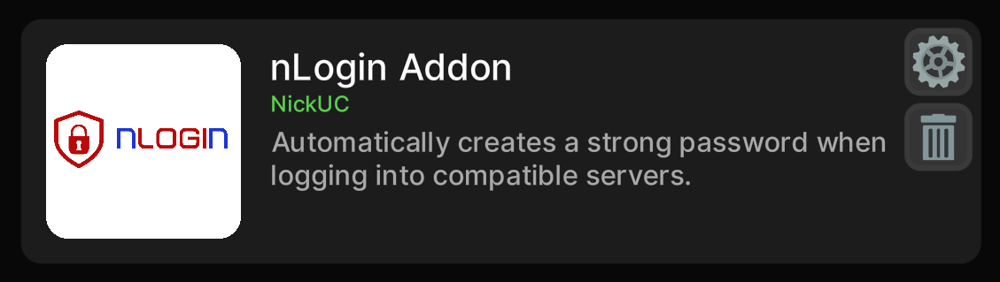
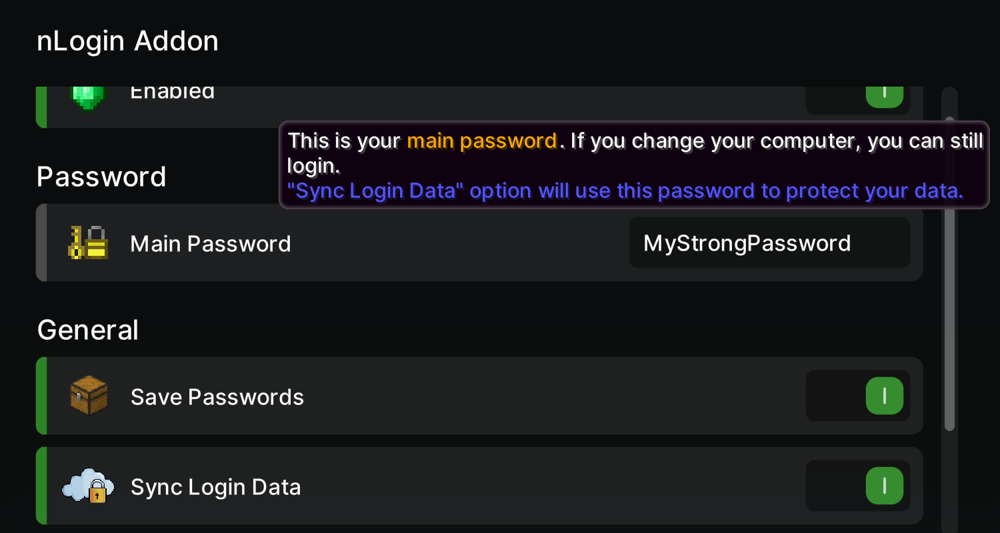
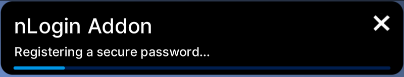

     
    
    <h3>Automatically creates a strong passwords/PINs when logging into compatible servers.</h3>

## Advantages

- 🔒 Password synchronization uses the **Zero-Knowledge Encryption** technique. This means that the server you access will not know your passwords, since the entire encryption/decryption process is handled by the client.
- 🖵 If you're recording, you **won't need to hide your screen** on the servers.
- 🤔 Securely save your passwords/PINs without having to remember them.
- 🔑 All generated passwords/pins will be created using a combination of letters, numbers and special characters.
- 🎲 All passwords generated use cryptographically secure generators.

## How it works:

1. When entering a server, the addon will send a <a href="https://github.com/nickuc-com/nLogin-Addon/blob/master/core/src/main/java/com/nickuc/login/addon/core/packet/outgoing/OutgoingHandshakePacket.java">OutgoingHandshakePacket</a> to the server.
2. If the server is compatible, it will reply with the <a href="https://github.com/nickuc-com/nLogin-Addon/blob/master/core/src/main/java/com/nickuc/login/addon/core/packet/incoming/IncomingReadyPacket.java">IncomingReadyPacket</a> to the client.
3. **If the user is not registered:**
   1. The addon will create a secure password.
   2. The server's public key will be stored.
   3. All data will be saved to credentials.json file.
4. **If the user is registered:**
   1. The addon will search for a registered password and use it if available. 
   2. If the password is not found and the synchronization feature is enabled along with a configured master password, the addon will attempt to decrypt the content stored remotely by the server using the <a href="https://github.com/nickuc-com/nLogin-Addon/blob/master/core/src/main/java/com/nickuc/login/addon/core/handler/PacketEvent.java#L149">main keys</a>.

## Dependencies

- [LabyMod 4](https://www.labymod.net/)

## Images

  

  

## Compiling

#### Requirements:
>- JDK 17

#### How to compile:

>- Clone this project repository with git
>- Run the command "gradlew.bat build" (Windows) or "./gradlew build" (Linux)

## License

[MIT](https://github.com/nickuc-com/nLogin-Addon/blob/master/LICENSE)